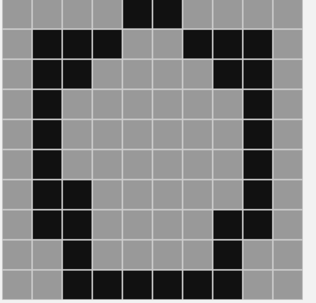
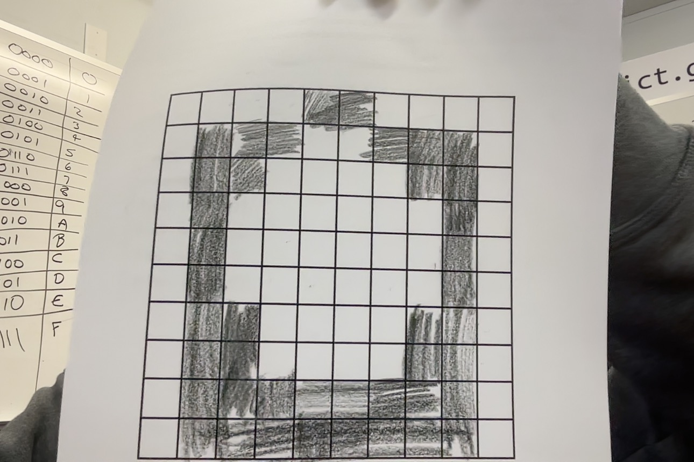

# this is my hex project

```	
0A
0A
04
9 9 9 9 1 1 9 9 9 9
9 1 1 1 9 9 1 1 1 9
9 1 1 9 9 9 9 1 1 9
9 1 9 9 9 9 9 9 1 9
9 1 9 9 9 9 9 9 1 9
9 1 9 9 9 9 9 9 1 9
9 1 1 9 9 9 9 9 1 9
9 1 1 9 9 9 9 1 1 9
9 9 1 9 9 9 9 1 9 9
9 9 1 1 1 1 1 1 9 9
```

alright so what you see above is the hex code for code.org.

these next 2 images were taken from me. first one is a screenshot. 





chris says this is a 100% so this a 100% yay. man coding is hard

